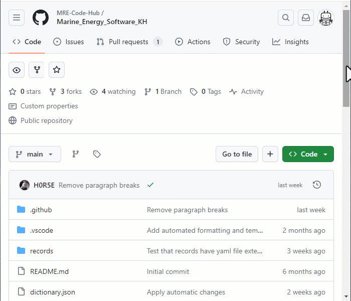
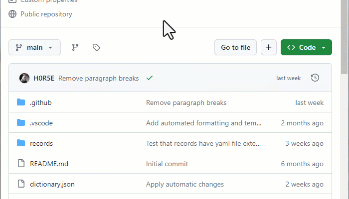
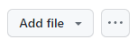

# Contributing Guidelines

For contributing to this repository, a [GitHub account][New Account] is
required. New contributions will open a [Pull Request][Pull Request] (PR) with
your suggested changes from a [fork][Fork] (of this repository) added to your
personal account. Contributions can be made directory from the GitHub UI,
without the need to download additional software. Once submitted, your PR will
be reviewed and either accepted or you will be notified of any changes
required.

Below, guides are provided for the for the following contribution types:

+ [Adding a new record](#adding-a-new-record)

## Adding a new record

Two possible approaches to adding a new record are shown below, with the first
two steps being different for each. Step 3 and beyond are identical for both
approaches.

### Approach A

In this approach, the record template is renamed and edited directly.

#### Step 1. Edit the `template.yaml` file

Click on the `template.yaml` file in the **Code** view and then click the edit
button. A new fork may be created.

#### Step 2. Rename the template

Click on the file name and change `template.yaml` to `records/<YOUR FILE
NAME>`. The forward slash (`/`) after `records` is important in order to place
the new file in the `records` folder.

Choose a file name that represents the software, but avoid using spaces. For
example `my_software.yaml`.

### Approach B

In this approach, the record template is copied and added to a new file created
in the `records` folder.

#### Step 1. Copy template contents

Click on the `template.yaml` file in the **Code** view and then copy
(Ctrl+C etc.) its contents. Then return to the repositories root directory.

#### Step 2. Add file in `records` folder

Click on the `records` folder. Then click on the `···` menu button. Click on
the `+ Create new file` option to open a new file.

Enter the name of your file. Choose a file name that represents the software,
but avoid using spaces. For example `my_software.yaml`.

Finally, paste the contents of the record template into the editing window.

For wider browser windows, the `+ Create new file` option can be found by
clicking on the `Add file` button.

### Step 3. Edit record fields

All required fields must be completed. These are marked as `REQUIRED` in the
comments on the template.

Delete options from lists, as appropriate. and enter data into string fields.
Where a string field has limited valid values, they will be listed in the
field's comment.

Optional fields can be deleted; however, *please endeavour to complete as many
fields as possible*.

The description field can contain paragraphs and blank lines. In the record,
one blank line represents a new paragraph and two blank lines produces a blank
line when rendered. Ensure the indentation is the same for all of the text.

Alternatively, for short descriptions, remove the block indicator (`>-`) and
add the text like a normal string field.

### Step 4. Propose changes

When ready click the **Commit changes** button. A pop-up will open where you
can add a short name for the new commit. Don't write in the "Extended 
description" box.

Now click the **Propose changes** button, followed by the **Create pull
request** button, which will open the pull request template.

### Step 5. Complete the pull request template

A template, in [GitHub Markdown format][GitHub MD] has been prepared to help
describe the changes made. Please complete this form to the best of your
ability. A preview of the rendered output can be seen by clicking the
**Preview** tab.

### Step 6. Create the pull request

Once the form is completed click the **Create pull request** button. Leave the
**Allow edits by maintainers** box ticked. Your new pull request is now created
and will be reviewed as soon as possible.

[New Account]: https://docs.github.com/en/get-started/start-your-journey/creating-an-account-on-github
[Pull Request]: https://docs.github.com/en/pull-requests
[Fork]: https://docs.github.com/en/pull-requests/collaborating-with-pull-requests/working-with-forks/fork-a-repo
[GitHub MD]: https://docs.github.com/en/get-started/writing-on-github/getting-started-with-writing-and-formatting-on-github/basic-writing-and-formatting-syntax
