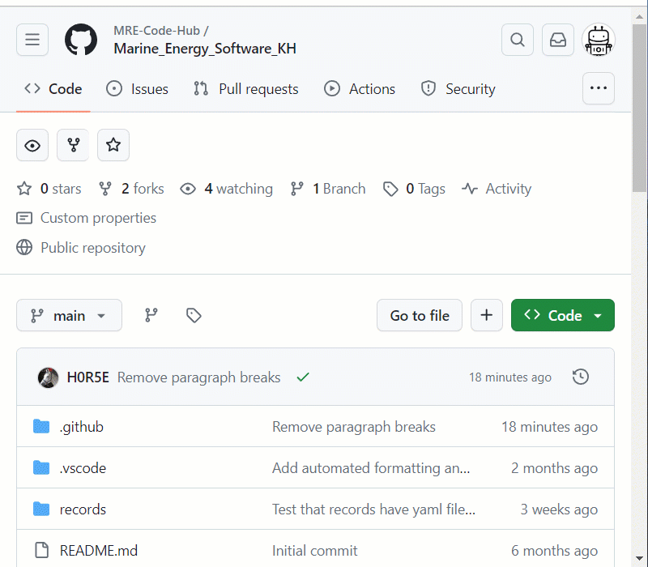
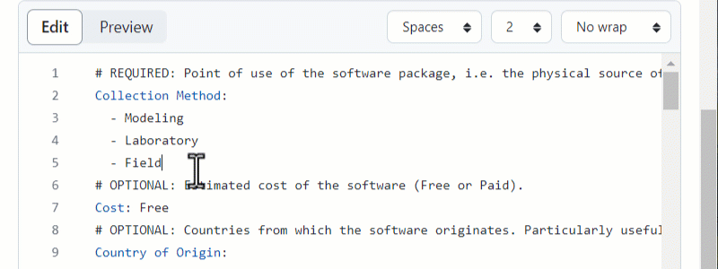
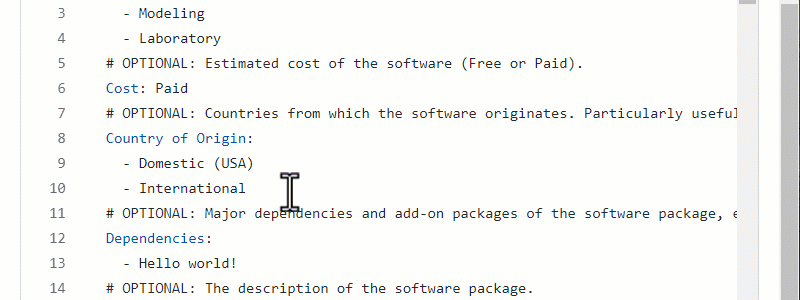
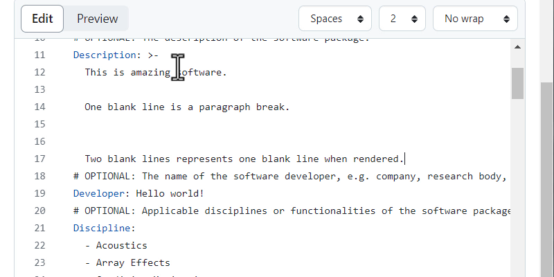
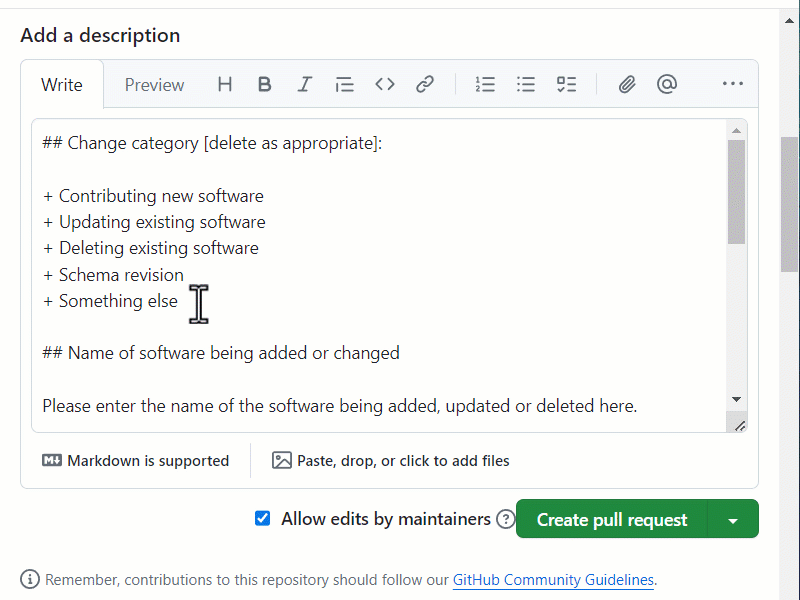
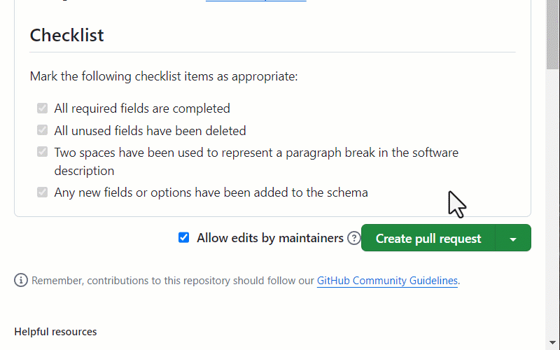

## Step 1. Edit the `template.yaml` file

Click on the `template.yaml` file in the **Code** view and then click the edit
button. A new fork may be created.

## Step 2. Rename the template

Click on the file name and change `template.yaml` to 
`records/<YOUR FILE NAME>`. The forward slash (`/`) after `records` is important in order to
place the new file in the `records` folder.

Choose a file name that represents the software, but avoid using spaces. For
example `my_software.yaml`.

## Step 3. Edit record fields

All required fields must be completed. These are marked as `REQUIRED` in the
comments on the template.

Delete options from lists, as appropriate. and enter data into string fields.
Where a string field has limited valid values, they will be listed in the
field's comment.

Optional fields can be deleted; however, *please endeavour to complete as many
fields as possible*.

The description field can contain paragraphs and blank lines. In the record,
one blank line represents a new paragraph and two blank lines produces a blank
line when rendered. Ensure the indentation is the same for all of the text.

Alternatively, for short descriptions, remove the block indicator (`>-`) and
add the text like a normal string field.

## Step 4. Propose changes

When ready click the **Commit changes** button. A pop-up will open where you
can add a short name for the new commit. Don't write in the "Extended 
description" box.

Now click the **Propose changes** button, followed by the **Create pull request**
button, which will open the pull request template.

## Step 4. Complete the pull request template

A template, in [GitHub Markdown format](https://docs.github.com/en/get-started/writing-on-github/getting-started-with-writing-and-formatting-on-github/basic-writing-and-formatting-syntax) has been prepared to help describe the
changes made. Please complete this form to the best of your ability. A preview
of the rendered output can be seen by clicking the **Preview** tab.

## Step 5. Complete the pull request template

Once the form is completed click the **Create pull request** button. Leave the
**Allow edits by maintainers** box ticked. Your new pull request will be
created, which will be reviewed as soon as possible.

