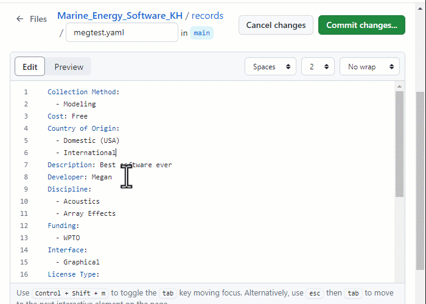

# Contributing Guidelines

For contributing to this repository, a [GitHub account][New Account] is
required. New contributions will open a [Pull Request][Pull Request] (PR) with
your suggested changes from a [fork][Fork] (of this repository) added to your
personal account. Contributions can be made directory from the GitHub UI,
without the need to download additional software. Once submitted, your PR will
be reviewed and either accepted or you will be notified of any changes
required.

Below, guides are provided for the for the following contribution types:

+ [Adding a new record](#adding-a-new-record)
+ [Editing an existing record](#editing-an-existing-record)

## Adding a new record

To add a new record, rename and edit the record template as shown in the steps
below.

### Step 1. Edit the `template.yaml` file

Click on the `template.yaml` file in the **Code** view and then click the edit
button. A new fork may be created.

### Step 2. Rename the template

Click on the file name and change `template.yaml` to `records/<YOUR FILE
NAME>`. The forward slash (`/`) after `records` is important in order to place
the new file in the `records` folder.

Choose a file name that represents the software, but avoid using spaces. For
example `my_software.yaml`.

### Step 3. Edit record fields

All required fields must be completed. These are marked as `REQUIRED` in the
comments on the template.

Delete options from lists, as appropriate. and enter data into string fields.
Where a string field has limited valid values, they will be listed in the
field's comment.

Optional fields can be deleted; however, *please endeavour to complete as many
fields as possible*.

The description field can contain paragraphs and blank lines. In the record,
one blank line represents a new paragraph and two blank lines produces a blank
line when rendered. Ensure the indentation is the same for all of the text.

Alternatively, for short descriptions, remove the block indicator (`>-`) and
add the text like a normal string field.

### Step 4. Propose changes

When ready click the **Commit changes...** button. A pop-up will open where you
can add a short name for the new commit. Don't write in the "Extended 
description" box.

Now click the **Propose changes** button, followed by the **Create pull
request** button, which will open the pull request template.

### Step 5. Complete the pull request template

A template, in [GitHub Markdown format][GitHub MD] has been prepared to help
describe the changes made. Please complete this form to the best of your
ability. A preview of the rendered output can be seen by clicking the
**Preview** tab.

### Step 6. Create the pull request

Once the form is completed click the **Create pull request** button. Leave the
**Allow edits by maintainers** box ticked. Your new pull request is now created
and will be reviewed as soon as possible.

## Editing an existing record

The steps below provide a guide for editing an existing software record.

### Step 1. Open the record template

Open the record template (`template.yaml`) for use as a reference. In the
example below, the template is opened in a separate browser tab.

### Step 2. Find and open the software's record file

To find a record file based on the title of the software, use the [File
Finder][File Finder] bar. Enter the software name using the format `Title:
<SOFTWARE_TITLE>` and press enter. The search should return a snippet of a
file containing the search term. Click on the file path (`records\****.yaml`)
to open it.

Once the file has opened, **ensure that the current branch is changed to
`main`**. Without this step, the file can not be edited.

### Step 3. Edit the file

To start editing the file, click the edit button. A new fork may be created.

### Step 4. Update record fields

Use the record template (opened in [step 1](#step-1-open-the-record-template))
to update fields and options in the existing record's file. Take care not to
remove any required fields and to keep the indentation correct. See [step
3](#step-3-edit-record-fields) of the "Adding a new record" guide for further
details.

### Step 5. Propose changes

When ready, click the **Commit changes...** button and a pop-up will open.
Don't write in the "Extended description" box.

Now click the **Propose changes** button, followed by the **Create pull
request** button, which will open the pull request template.

### Step 6. Complete the pull request template

A template, in [GitHub Markdown format][GitHub MD] has been prepared to help
describe the changes made. Please complete this form to the best of your
ability.

### Step 7. Create the pull request

Once the form is completed click the **Create pull request** button. Leave the
**Allow edits by maintainers** box ticked. Your new pull request is now created
and will be reviewed as soon as possible.

[New Account]: https://docs.github.com/en/get-started/start-your-journey/creating-an-account-on-github
[Pull Request]: https://docs.github.com/en/pull-requests
[Fork]: https://docs.github.com/en/pull-requests/collaborating-with-pull-requests/working-with-forks/fork-a-repo
[GitHub MD]: https://docs.github.com/en/get-started/writing-on-github/getting-started-with-writing-and-formatting-on-github/basic-writing-and-formatting-syntax
[File Finder]: https://docs.github.com/en/search-github/searching-on-github/finding-files-on-github
